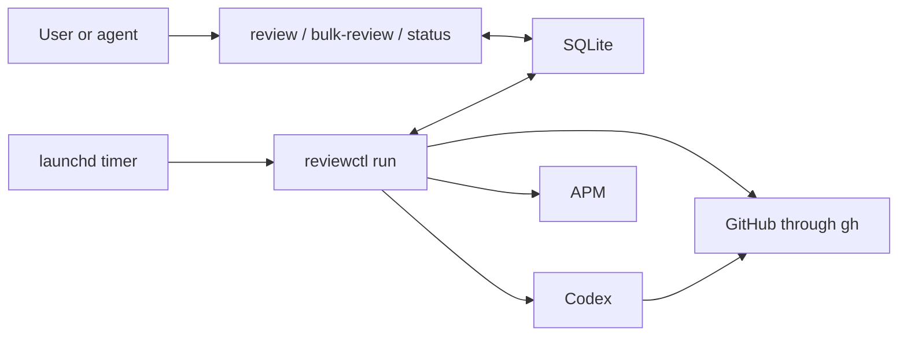

# reviewctl architecture

Status: Accepted MVP design

Last updated: 2026-08-20

## Purpose

`reviewctl` schedules Codex reviews of GitHub pull requests on one trusted laptop. It polls configured repositories,
keeps a local queue, invokes Codex, and records the result in SQLite.

The tool uses the user's Codex subscription and GitHub CLI credentials. It does not require a hosted service, webhook,
GitHub App, GitHub Actions workflow, or separate API billing.

## Design constraints

- One `reviewctl run` process may execute work at a time.
- Other CLI processes may add pull requests or read status while `run` is active.
- GitHub is the only provider in the MVP.
- Codex is the only harness in the MVP.
- Pull request authors must appear in an explicit trust list before Codex may inspect or run their code.
- The implementation favors operating-system and SQLite behavior over custom coordination code.

The MVP leaves two source-level extension boundaries: one for another provider, such as GitLab, and one for another
harness. It does not implement either extension or a plugin system.

## Process model

`reviewctl` is a stateless CLI. Durable state lives in SQLite. An operating-system scheduler invokes `reviewctl run`
at a fixed interval.

On macOS, `launchd` owns the schedule and process restart behavior:

```text
launchd
   |
   | every configured interval
   v
reviewctl run
   |
   +-- discover GitHub changes
   +-- add pull requests to SQLite
   +-- process one queue snapshot
   +-- exit
```

`run` takes one process lock for its entire lifetime. A second `run` reports `already running` and exits without
changing state. Producer and reader commands do not take this lock.

The lock prevents two consumers from executing the same queue. It does not protect SQLite. SQLite transactions
coordinate concurrent queue inserts, history writes, and status reads.

`reviewctl` does not hold a SQLite transaction while it calls GitHub, installs skills, or runs Codex.

## Components



| Component | Responsibility |
| --- | --- |
| CLI | Parse commands, validate local input, and perform short SQLite operations |
| Run cycle | Discover changes and process one queue snapshot sequentially |
| GitHub code | Resolve repositories, pull requests, authors, and current heads through `gh` |
| Codex code | Start and cancel Codex, then decode its receipt |
| APM | Install the locked review skills into a fresh attempt workspace |
| SQLite | Store discovery baselines, the pending pull request set, and review history |

## Configuration

Configuration lives at `$XDG_CONFIG_HOME/reviewctl/config.yaml`, or `~/.config/reviewctl/config.yaml` when
`XDG_CONFIG_HOME` is unset.

```yaml
harness: codex
publish: true

trusted_authors:
  - alice
  - dependabot[bot]

repositories:
  - provider: github
    repository: acme/service-a
  - provider: github
    repository: acme/service-b
```

The MVP accepts only `github` and `codex`. The names keep the two agreed extension boundaries visible without adding
runtime registries, capability negotiation, or plugin loading.

`trusted_authors` must contain at least one exact GitHub login. Comparison is case-insensitive after normalization. An
empty list blocks discovery and execution.

Automatic publication requires `publish: true`. This permission is checked before each Codex invocation and is
included in the trusted instruction. GitHub and Codex credentials remain owned by their CLIs.

The implementation decodes YAML directly. It does not use a configuration precedence framework.

## Discovery baseline

The baseline records the last observed state of each open pull request in each configured repository. It is not a job
queue or execution history.

The first successful poll of a repository establishes its baseline:

- Existing ready pull requests are recorded without being queued.
- Existing drafts are recorded so a later ready transition can be detected.

Later polls enqueue a pull request when:

- a new pull request is ready for review;
- a draft becomes ready; or
- the head SHA of an eligible pull request changes.

The fetched GitHub snapshot is obtained outside a database transaction. Queue inserts and the corresponding baseline
update use one short SQLite transaction, so a crash cannot advance the baseline without recording the work.

Discovery requests a 1,001-item sentinel through `gh`. A repository with more than 1,000 open pull requests fails
discovery without changing its baseline or queue; supporting that repository requires pagination.

A skill or trust-list change does not enqueue every open pull request. The user may enqueue selected pull requests
explicitly.

## Review queue

The queue is the durable set of pull requests that still need a review. A queue entry identifies only the pull
request:

```text
provider + repository + provider-local change number
```

The MVP uses `github` and a pull request number. The provider field allows a later GitLab implementation to use a merge
request IID without changing the queue model.

The queue does not store leases, owners, worker generations, retry deadlines, job states, skill digests, receipts, or
workspace paths. Duplicate events use `INSERT OR IGNORE` against the pull request identity.

The service resolves the current head SHA when it starts a review. If the head changes while a pull request waits, only
the latest revision needs review.

One `run` invocation reads a queue snapshot and processes every entry in that snapshot at most once, in deterministic
insertion order. Entries added after the snapshot wait for the next invocation.

On confirmed success, `run` records history and deletes the pull request from the queue in one transaction. On failure,
it records the error and leaves the pull request queued. The operating-system schedule supplies the retry cadence; the
MVP has no retry loop, backoff policy, or retry counter.

This model provides crash recovery without a running state. A pull request remains queued until success. If Codex
publishes a review and the process exits before deleting the entry, the next run recovers the existing review through
its marker and readback instead of publishing a duplicate.

## History

Review history is separate from the queue and never controls scheduling. Each processing attempt records a bounded row
with:

- pull request identity and reviewed head SHA;
- start and finish times;
- success or failure;
- review verdict when available;
- published review identifier and URL when available; and
- a bounded error code and message on failure.

The MVP does not copy the complete published review body into SQLite because GitHub already stores it. The history
schema may add the body later if local, unpublished reviews need durable retrieval.

History is append-only for normal operation. Retention and telemetry export are outside the MVP.

## Producer commands

Producer commands add work and exit after SQLite confirms the transaction:

```text
reviewctl review <pull-request-url>
reviewctl bulk-review <pull-request-url>...
```

`review` accepts exactly one pull request. Automatic discovery calls the same enqueue application function; it does
not start a nested CLI process.

`bulk-review` is a manual convenience for a user or agent. It validates the list, adds the pull requests in one short
transaction, and reports which entries were added or already present. It does not execute Codex or create a separate
batch scheduler.

Both commands may run while `run` is active. SQLite may briefly wait for another SQLite transaction, but neither
command waits for a review to finish.

## Run cycle

`reviewctl run` performs one cycle and exits:

1. Acquire the process lock.
2. Load and validate configuration.
3. Poll configured GitHub repositories and update the baseline and queue.
4. Read one deterministic snapshot of the queue.
5. Process each snapshot entry once, sequentially.
6. Release the process lock and exit.

Parallel Codex sessions are outside the MVP. If sequential execution becomes too slow, one `run` process may later
divide its snapshot among a bounded in-memory worker pool. The queue schema does not need leases or worker ownership
for that change.

## Review attempt

One attempt is one Codex execution for one queued pull request. The attempt resolves and pins these values before Codex
starts:

```text
provider + repository + pull request number + head SHA + installed skill digest
```

The execution path is linear:

1. Resolve the configured pull request and current head through `gh`.
2. Verify that the repository is configured and the exact author login is trusted.
3. Create a fresh temporary workspace.
4. Install and hash the locked skill set with APM.
5. Write one trusted instruction.
6. Run Codex. The instruction requires Codex to check the marker, publish when needed, and read the review back.
7. Validate the receipt and current head.
8. Remove the entire workspace.
9. Record history, then remove the queue entry only after confirmed success.

`APPROVE`, `REQUEST_CHANGES`, and `COMMENT` are successful review outcomes. `COMMENT` is used when GitHub forbids a
decisive review because the authenticated reviewer authored the pull request. These outcomes are not process failures.

If the head changes before or during the attempt, the attempt does not publish for the old head. The queue entry stays
in place, and the next run resolves the new head.

## Trust and publication

Only pull requests from configured authors are eligible. `reviewctl` checks the exact normalized GitHub login before
Codex starts. An untrusted pull request is never cloned, executed, or published. The MVP has no bypass flag.

The trusted instruction limits Codex to one repository, pull request, expected head SHA, installed skill set, and
publication policy. Repository instructions may guide review and test commands, but they cannot broaden that scope.

Codex and the installed review skill own review analysis and GitHub publication. `reviewctl` does not compose inline
comments or call the GitHub Review API itself.

Before publication, Codex must check the current head and the exact idempotency marker. If the marker already exists,
Codex reads that review instead of publishing again. After publication, Codex reads the new review back. In both cases,
it returns a short receipt containing the verdict, head SHA, review identifier, and review URL.

`reviewctl` validates the receipt and checks the final head through `gh`. It does not implement marker lookup, review
composition, publication, or review readback. A valid receipt for a recovered marker is a successful result.

Before Codex, `reviewctl` resolves the authenticated GitHub login directly through `gh`. A `COMMENT` receipt is valid
only when that normalized login equals the already-verified pull request author; receipt data cannot establish reviewer
identity.

The trust policy assumes one trusted user account on one trusted laptop. It does not defend against another process
running as that user or prove who authored every commit in a trusted pull request.

## Skills and APM

The source checkout contains one `apm.yml` and one `apm.lock.yaml`. The manifest may list several skills required for
review. The lockfile pins their exact versions.

Each attempt runs:

```shell
apm install --frozen --root <attempt-workspace> --target codex
```

`reviewctl` hashes the installed skill set once and includes the digest in the instruction, marker, receipt validation,
and history. An APM failure stops the attempt before Codex starts and is recorded in history.

`reviewctl` does not implement skill lookup, copying, snapshot recovery, or configuration precedence. Updating review
skills means updating the checked-in APM lockfile.

## Workspace

Each attempt uses a new temporary directory. The workspace contains the APM installation, trusted instruction, receipt
path, and source checkout. The implementation uses ordinary temporary-directory creation and recursive removal.

The workspace is deleted after success or failure. A later retry creates a new workspace. SQLite retains only bounded
history, not source files, diffs, or complete process output.

The MVP does not recover, reuse, fence, reference-count, or selectively clean workspaces. It does not implement custom
filesystem capabilities or defend against the trusted local user replacing files during execution.

## Provider and harness boundaries

GitHub-specific calls live together, and Codex-specific process handling lives together. Application code calls these
two narrow boundaries without a runtime plugin registry.

A GitLab implementation may later add provider-specific discovery and merge request handling. Another harness may
later add its own command and receipt decoding. Neither future implementation is part of the MVP, and the MVP does not
normalize features that GitHub and Codex do not need.

## CLI surface

```text
reviewctl [--json] init --repository <owner/name> --trusted-author <login>...
reviewctl [--json] doctor
reviewctl [--json] review <pull-request-url>
reviewctl [--json] bulk-review <pull-request-url>...
reviewctl [--json] run
reviewctl [--json] status [--limit <count>]
reviewctl --help
reviewctl --version
```

- `init` creates configuration without overwriting an existing file.
- `doctor` checks configuration, GitHub, Codex, APM, the locked skill set, SQLite, and local paths.
- `review` enqueues one pull request.
- `bulk-review` enqueues several pull requests in one transaction.
- `run` performs one discovery and processing cycle.
- `status` shows the pending queue, bounded recent history, and whether a `run` lock is held. Its default history limit
  is 20.

Commands do not open an editor, pager, or interactive confirmation. They do not depend on the source checkout or the
caller's current directory.

## Agent-friendly CLI contract

Human-readable text is the default. The global `--json` flag gives every operational command one deterministic,
machine-readable result. JSON mode writes exactly one JSON object to stdout on success or failure. Stderr is reserved
for diagnostics and never contains result data. The MVP emits no color or progress animation.

The process exit code has only three meanings:

- `0`: success or a safe idempotent no-op, including `already_queued` and `already_running`;
- `1`: an operational failure, including a `run` in which any queued review failed; and
- `2`: invalid command syntax or input.

JSON failures contain a short stable error `code` and a bounded message. The MVP does not add report versions, JSON
Schema files, or a separate agent protocol.

Command results expose the smallest useful facts:

- `init` returns the configuration path it created.
- `doctor` returns each prerequisite and whether it is ready.
- `review` returns the pull request identity and `queued` or `already_queued`.
- `bulk-review` returns one result per argument in input order.
- `run` returns discovery and processing counts plus the outcome and review URL for each attempted pull request.
- `status` returns the queue, at most the requested number of history rows, and whether `run` is active.

Help text states that `review` and `bulk-review` change only the local queue, while `run` may publish GitHub reviews
when publication is enabled. This keeps the external-write boundary visible to a calling agent without adding an
interactive confirmation.

## Local persistence

Default paths follow XDG conventions:

```text
config: $XDG_CONFIG_HOME/reviewctl/config.yaml
state:  $XDG_STATE_HOME/reviewctl/reviewctl.db
cache:  $XDG_CACHE_HOME/reviewctl/
lock:   $XDG_RUNTIME_DIR/reviewctl/run.lock
```

When an XDG variable is unset, `reviewctl` uses the corresponding user directory under `~/.config`, `~/.local/state`,
or `~/.cache`. The lock falls back to the state directory when no runtime directory is available.

## Consistency rules

- Only one `run` process consumes the queue.
- Producer and status commands remain available while `run` is active.
- The queue contains one entry per pull request.
- A queue entry is deleted only after confirmed success or recovery of an existing published review.
- Every failed Codex execution writes bounded history and leaves the pull request queued.
- Discovery updates the baseline and queue atomically.
- No database transaction remains open during external commands.
- No untrusted pull request reaches Codex.
- Publication requires explicit configuration and an exact head check.
- GitHub review outcomes remain separate from process success or failure.

## Tests

Unit tests cover pure configuration, URL parsing, trust checks, event detection, marker and receipt validation, and
queue decisions.

Integration tests use real SQLite and temporary directories. Scripted `gh`, APM, and Codex processes verify one full
cycle, concurrent producers, process-lock behavior, failure retention, success deletion, history, cancellation, and
marker recovery. Tests do not reproduce a multiprocess lease or filesystem attack matrix.

Black-box CLI tests invoke the built command from a temporary directory without a TTY. They parse every `--json`
result, verify stdout and stderr separation, exit codes, deterministic bulk ordering, bounded status output, and the
documented idempotent no-op results.

A local live end-to-end test uses the real GitHub and Codex credentials only on the
[canonical fixture PR](https://github.com/denifilatoff/reviewctl/pull/24). It rechecks the repository, pull request,
author, open non-draft state, and head before Codex. It then verifies the published review and history, enqueues the
fixture again, and verifies marker recovery without duplicate publication. Missing live prerequisites block this test
rather than turning it into a passing skip.

## Non-goals

- Multiple concurrent `run` consumers.
- Parallel Codex sessions in the MVP.
- Renewable leases, worker ownership, retry deadlines, or crash reclaim.
- A long-running daemon, IPC protocol, or HTTP control server.
- Runtime provider or harness plugins.
- GitLab or a harness other than Codex.
- Workspace reuse or recovery.
- A custom secure filesystem layer.
- Storing complete diffs, source trees, or published review bodies in SQLite.
- A service installer, packaged distribution, self-update, or multi-OS support.
