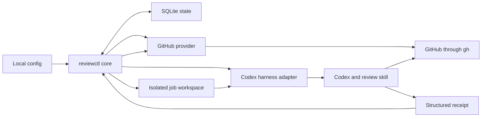

# reviewctl architecture

Status: Accepted MVP design

Last updated: 2026-08-20

## Purpose

`reviewctl` is a local scheduler for agent-driven pull request reviews. It watches a configured set of repositories,
starts a coding-agent harness for eligible pull requests, and records the result on the user's machine.

The tool runs from the user's laptop with the user's existing Codex subscription and GitHub CLI credentials. It does
not require a GitHub App, GitHub Actions workflow, hosted service, or API billing integration.

The initial implementation is built and run from source on the current development machine.

## MVP goals

- Detect new pull requests and new head revisions in configured GitHub repositories.
- Run an explicit list of existing pull requests on demand.
- Invoke Codex with a trusted review skill and a job-specific instruction.
- Let the review agent inspect the pull request, run relevant checks, and publish the review when authorized.
- Prevent duplicate work across retries and concurrent `reviewctl` processes.
- Keep configuration, state, workspaces, and logs on the local machine.
- Leave narrow code seams for additional harnesses and code-hosting providers.

## MVP non-goals

- A hosted control plane, webhook receiver, GitHub App, or GitHub Action.
- Runtime harness plugins or provider plugins.
- A GitLab implementation.
- A harness other than Codex.
- Safe execution of code from untrusted pull request authors.
- A service installer for `launchd`, `systemd`, cron, or Windows services.
- Packaged installers, self-update, uninstall, or multi-OS distribution support.
- File or standard-input submission of pull request lists.
- A TUI or web interface.
- APM as a runtime dependency.

## System view



`reviewctl` is a thin dispatcher. Deterministic code owns discovery, state, trust checks, concurrency, workspace
lifecycle, harness invocation, and result verification. The agent and review skill own the semantic review workflow,
including GitHub reads, source inspection, optional test execution, review composition, and publication.

## Responsibility boundaries

| Component | Owns | Does not own |
| --- | --- | --- |
| Core | Configuration, polling, jobs, leases, concurrency, retries, and cleanup | Review judgment or provider syntax |
| Provider | Discovery, heads, authors, and receipt verification | Review judgment and harness execution |
| Harness adapter | Checks, command, skill placement, and receipt decoding | Scheduling and provider policy |
| Agent and skill | Analysis, checks, findings, verdict, and publication | Scheduling, trust policy, and state |
| SQLite store | Durable metadata, attempts, receipts, and leases | Repository contents, diffs, or credentials |
| Job workspace | Trusted inputs, skill snapshot, checkout, and transient outputs | Durable scheduling state |

## Configuration

The user or an agent creates the initial configuration at:

```text
$XDG_CONFIG_HOME/reviewctl/config.yaml
```

If `XDG_CONFIG_HOME` is unset, the path is `~/.config/reviewctl/config.yaml`.

A conceptual MVP configuration is:

```yaml
harness: codex

skill:
  name: adversarial-code-review
  directory: ~/.config/reviewctl/skills

trusted_authors:
  - alice
  - bob
  - dependabot[bot]

poll_interval: 5m
parallel: 1
publish: true

repositories:
  - provider: github
    repository: acme/service-a
  - provider: github
    repository: acme/service-b
```

The following rules apply:

- `trusted_authors` is required and must contain at least one GitHub login.
- Logins are normalized to lowercase before exact comparison.
- A missing or empty trust list makes `doctor`, `run`, and `review` fail closed.
- `repositories` is required and must contain at least one repository.
- `github` is the only accepted provider in the MVP.
- `codex` is the only accepted harness in the MVP.
- `parallel` defaults to `1`. A command-line flag may set a different bounded value for one invocation.
- Automatic mode requires an explicit `publish: true` in the configuration. `run` fails closed when it is absent or
  false.
- Manual publication requires the explicit `--publish` flag.

The implementation parses YAML directly. It does not use Viper or another configuration-precedence framework.

## Trust model

The MVP treats pull requests from configured authors as trusted code.

Before creating a job, the GitHub provider reads the pull request author's GitHub login and checks it against
`trusted_authors`. It repeats the check immediately before starting Codex.

For an untrusted author, `reviewctl` does not clone the source, start Codex, run code, or publish a review. This rule
applies to both automatic discovery and explicit `reviewctl review` commands. The MVP has no bypass flag.

Trusted jobs may run repository tests, builds, and scripts when the review skill considers them useful. The generated
job instruction remains authoritative for the selected repository, pull request, expected head revision, and
publication permission. Repository instructions may guide build and review behavior, but they cannot broaden that
scope.

This is a practical trust policy, not proof of commit provenance. A trusted pull request author does not prove who
created every commit or who can update the head branch. The MVP accepts this limitation. A future hardening phase may
add static-only review, restricted GitHub credentials, commit provenance checks, or a constrained GitHub command
proxy.

## Automatic discovery

`reviewctl run` polls each configured repository through its provider adapter. It is a foreground process. The user
may supervise it directly or start it with an operating-system service manager.

Discovery considers every open pull request, regardless of requested reviewers. Bot accounts are ordinary authors
and must appear in `trusted_authors`.

Each repository receives an independent baseline when it first appears in the configuration:

- Existing ready pull requests are recorded without starting reviews.
- Existing draft pull requests are recorded so a later ready transition can trigger a review.
- Pull requests created after the baseline are eligible.

After the baseline, the following events create work:

- A new pull request becomes ready for review.
- A draft pull request becomes ready for review.
- The head SHA of an eligible pull request changes.

A skill update or trust-list update alone does not enqueue every open pull request again. The user can explicitly
review selected pull requests after either change.

`reviewctl run --once` performs one discovery and processing cycle and then exits. This supports cron-like execution
without adding a daemon mode.

## Explicit review

`reviewctl review` accepts one or more pull request URLs as positional arguments:

```shell
reviewctl review \
  https://github.com/acme/service-a/pull/42 \
  https://github.com/acme/service-b/pull/17 \
  --publish \
  --parallel 2 \
  --output json
```

The command resolves each current head SHA, applies the trusted-author policy, creates missing jobs, processes them,
and waits for completion. A single command can therefore process a list of 10 to 50 existing pull requests without a
separate batch abstraction.

The same durable job store and leases are shared with `reviewctl run`. If the command is interrupted, running it again
resumes or skips work according to the persisted state.

Without `--publish`, the agent does not change GitHub. The command returns the complete local review result.

## Job identity and lifecycle

A review attempt is identified by:

```text
provider + repository + provider-local change number + head SHA + skill digest + publication intent
```

The skill digest is part of the attempt identity, but not an automatic discovery trigger. This distinction allows an
explicit command to run a revised skill against the same head without causing an automatic review storm after every
skill update. Publication intent distinguishes a local review from a review that may write to the provider. Running a
local review never prevents a later `--publish` invocation for the same revision.

Jobs use these states:

```text
queued -> running -> succeeded
                  -> failed
                  -> stale
```

`APPROVE` and `REQUEST_CHANGES` are successful review outcomes. They are not process failures.

Each running job holds a renewable SQLite lease. Another `reviewctl` process may inspect the job but cannot execute it
while the lease is valid. After a process crash or lease expiration, the job becomes eligible for a bounded retry.

Transient harness and provider failures use bounded retries with backoff. Invalid configuration, missing credentials,
untrusted authors, and unsupported harness or provider names fail without retry.

## Job workspace

`reviewctl` creates and owns one workspace per job:

```text
<cache>/reviewctl/jobs/<job-id>/
├── .agents/
│   └── skills/
│       └── adversarial-code-review/
├── instruction.md
├── job.json
├── receipt.schema.json
└── source/
```

The workspace contains a snapshot of the trusted skill, not a skill supplied by the pull request branch. `reviewctl`
computes the snapshot digest before starting the harness and records it with the job.

The agent may use `gh` and `git` inside `source/` to obtain and inspect the exact pull request revision. `reviewctl`
removes the source checkout after the job reaches a terminal state. It retains bounded diagnostic logs, job metadata,
and the structured receipt. SQLite does not store source files or complete diffs.

## Agent instruction and receipt

Every invocation receives a generated, trusted instruction containing at least:

- Provider and repository.
- Pull request number and canonical URL.
- Expected head SHA.
- Job identifier and skill digest.
- Whether publication is allowed.
- The required review skill name.
- The required receipt schema.

Before publication, the agent must:

1. Read the current head SHA again.
2. Stop without publishing if the SHA differs from the expected value.
3. Check for an existing `reviewctl` marker for the same attempt.
4. Publish a review anchored to the expected revision.
5. Read the published review back from GitHub.
6. Return its identifier and URL in the receipt.

Published reviews include a hidden idempotency marker:

```html
<!-- reviewctl job=<job-id> head=<sha> skill=<digest> -->
```

The provider adapter verifies the receipt after Codex exits. If the head changed, the current job becomes `stale`, and
normal discovery can enqueue the new revision. A retry first looks for the marker so a partial failure does not create
a duplicate review.

## Skill resolution and APM

The review skill is resolved in this order:

1. A command-line `--skills-dir` override.
2. `skill.directory` in `config.yaml`.
3. `$HOME/.agents/skills`.
4. Failure with an actionable diagnostic.

The pull request checkout is never a skill source. Each job uses a copied snapshot so a global skill update cannot
change a running review.

APM is an optional installation mechanism. APM can install and pin the skill in a directory that `reviewctl` already
searches, but `reviewctl` does not invoke APM and does not require an APM manifest or lockfile. This keeps the runtime
small while preserving compatibility with APM-managed skills.

## Harness boundary

Harness support is compiled into the binary. The MVP uses a small switch and one Codex-specific file rather than a
plugin framework:

```text
internal/harness/
├── harness.go
└── codex.go
```

The common harness boundary accepts a prepared job and returns a validated receipt. `codex.go` owns Codex installation
checks, command construction, isolated working-directory settings, skill placement, process cancellation, and native
structured-output handling.

A future harness is added by creating another source file and adding one switch case. Dynamic plugins, capability
negotiation, and a public harness SDK are outside the MVP.

## Provider boundary

Provider support follows the same compiled-in pattern:

```text
internal/provider/
├── provider.go
└── github.go
```

The GitHub provider owns deterministic discovery, author lookup, current-head lookup, and receipt verification through
`gh`. It does not implement review judgment or publication composition. Those remain in the agent and skill workflow.

The common target model contains a provider name, repository identity, provider-local change number, canonical URL,
head SHA, draft state, and author login. GitHub maps the change number to a pull request number. A future GitLab
provider maps it to a merge request IID. Other provider-specific terminology stays inside its adapter.

A future GitLab implementation adds `gitlab.go`, uses `glab`, and maps merge requests into the same target model. It
does not require changes to the scheduler or harness adapter. The architecture does not attempt to normalize GitHub
reviews and GitLab discussions before that implementation exists.

## CLI surface

The MVP command surface is intentionally small:

```text
reviewctl doctor
reviewctl init --repository <owner/name> --trusted-author <login>...
reviewctl review <PR>... [--publish] [--parallel N] [--output text|json]
reviewctl run [--once] [--parallel N]
reviewctl status [--output text|json]
reviewctl --help
reviewctl --version
```

- `doctor` validates configuration, the trust list, repositories, GitHub authentication, Codex authentication, the
  selected skill, and writable local paths.
- `init` writes a new configuration from explicit repository and trusted-author arguments. It refuses to overwrite an
  existing file and leaves publication disabled.
- `review` processes an explicit list synchronously.
- `run` discovers and processes eligible pull requests.
- `status` reports scheduler state, active jobs, recent outcomes, and actionable failures.

The CLI uses Cobra for command parsing and help generation. Cobra remains a transport layer; application logic does
not depend on Cobra. Configuration uses a direct YAML decoder, and durable state uses SQLite.

## Output contract

Human-readable text is the default. `--output json` returns one structured result document on standard output.
Progress and diagnostics go to standard error so they cannot corrupt structured output.

Errors in JSON mode contain a stable machine-readable code, a message, whether retry may help, and an actionable hint.
Exit status reports process success or failure. A valid `REQUEST_CHANGES` review exits successfully.

The CLI does not open an editor, pager, or interactive confirmation during `run` or `review`. GitHub publication is
authorized only by configuration for `run` or by `--publish` for `review`.

## Local persistence

Default paths follow XDG conventions:

```text
config: $XDG_CONFIG_HOME/reviewctl/config.yaml
state:  $XDG_STATE_HOME/reviewctl/reviewctl.db
cache:  $XDG_CACHE_HOME/reviewctl/jobs/
```

The fallbacks are:

```text
config: ~/.config/reviewctl/config.yaml
state:  ~/.local/state/reviewctl/reviewctl.db
cache:  ~/.cache/reviewctl/jobs/
```

GitHub and Codex credentials remain owned by their respective CLIs. `reviewctl` does not copy tokens into its
configuration or database.

## Consistency invariants

- No harness starts before repository, provider, author, and configuration checks succeed.
- An empty trust list never means "trust everyone."
- Publication never occurs without explicit permission.
- A receipt must identify the expected repository, pull request, head SHA, and skill digest.
- Only one process may hold the lease for a job at a time.
- A running job always uses an immutable skill snapshot.
- Pull request verdicts remain separate from process failures.
- Provider and harness concerns remain independent.

## Test architecture

Tests use three execution levels.

### Unit tests

Unit tests cover deterministic policy and state transitions without SQLite, filesystem access, child processes,
network access, or real sleeps. They use table-driven cases for configuration validation, fail-closed trust and
publication, login normalization, job identity, state transitions, retry classification, backoff with a fake clock,
discovery decisions, pull-request URL parsing, receipt and marker validation, and output mapping.

Every behavior change starts with a failing test at the lowest layer that can prove it. A regression test remains at
that layer. Coverage is diagnostic for the MVP; there is no numeric blocking threshold.

### Integration tests

Integration tests use real SQLite migrations, transactions, and leases; real temporary filesystem workspaces and skill
snapshots; and the real built `reviewctl` process, including cancellation. They replace only external `gh` and Codex
processes with narrow scripted command doubles and replace clocks when deterministic time control is required. They do
not use credentials or network access.

`make test-unit` and `make test-integration` run the two hermetic suites. `make ci` includes both and runs on every pull
request.

### Local live end-to-end test

`make test-e2e` runs one local live scenario with the user's real `gh` and Codex installations and resources from the
user's machine. It targets a dedicated allowlisted fixture repository and pull request, publishes a real review, reads
the review back, repeats the same attempt, and proves that the idempotency marker prevents a duplicate. The evidence
records the repository, pull request, head SHA, published review URL, receipt, and final SQLite state.

The live test does not run in GitHub Actions. After the first runnable `review --publish` vertical slice, run it at the
end of every task that changes provider publication, harness execution, receipt validation, job identity, or retry and
idempotency behavior. Run it once more against the final `main`. Missing credentials, harness access, or fixture setup
is a blocker, not a pass or silent skip.

## Expected extensions

The design leaves room for these additions without implementing them:

- Another harness through a new compiled-in harness file.
- GitLab through a new compiled-in provider file.
- Static-only processing for untrusted authors.
- Restricted credentials or a constrained provider-command proxy.
- File or standard-input submission for lists larger than practical command lines.
- APM-managed installation instructions or a separate `reviewctl` usage skill.
- Packaged distribution, self-update, uninstall, and multi-OS lifecycle support when use beyond the current
  development machine makes that work necessary.
